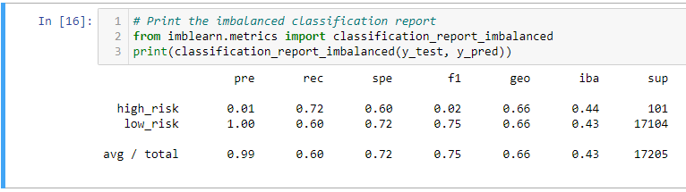
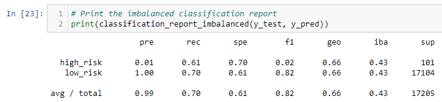
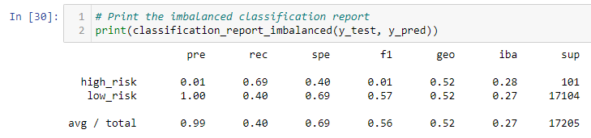
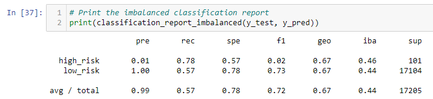
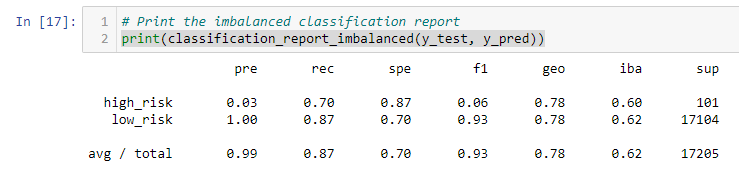
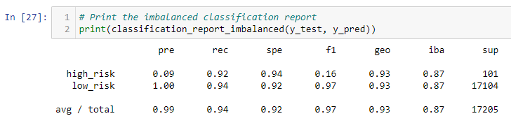
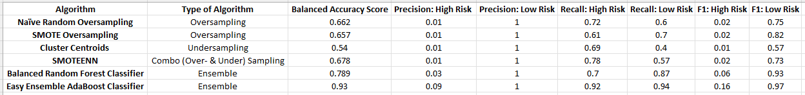

# Credit Risk Analysis: Analysis of Supervised Machine Learning Models

## Overview of the Analysis: 

The purpose of this analysis was to evaluate the performance of 6 different machine learning models for predicting credit risk. 

Credit risk is an inherently unbalanced classification problem, since low-risk loans greatly outnumber risky loans. Therefore, we needed to employ different techniques to train and evaluate models with unbalanced classes utilizing the imbalanced-learn and scikit-learn libraries. 

We utilized a credit card application dataset from LendingClub, a peer-to-peer lending services company, to test out different machine learning algorithms: 
- First we oversampled the data using the following:  
  - **Naive Random Oversampling**
  - **SMOTE Oversampling**
- Then we undersampled the data using the following:  
  - **Cluster Centroids Undersampling**
- Then, we used a **combinatorial approach** of over- and undersampling using the **SMOTEENN algorithm**. 
- Next, we compared two new Ensemble machine learning models that reduce bias: 
  - **Ensemble Balanced Random Forest Classification**
  - **Easy Ensemble AdaBoos Classification** 

We then evaluated the performance of these models to determine whether or not any of them would be suitable for predicting credit risk. 

## Overview of Machine Learning Performance Metrics: 

We can evaluate a model's performance based on various metrics including balanced accuracy scores, precision scores, and recall scores. 

- A **Balanced Accuracy Score** is designed to evaluate imbalanced datasets, such as our credit card application data. It refers to the average of recall obtained on each class. The best value is 1 and the worst value is 0. 

- **"Recall" (or sensitivity)** measures how many people who actually have a condition were correctly predicted as such. This metric takes into account all positives, including both true positives and false negatives.  
  - Recall = TP / (TP + FN) 
  - In the context of our credit risk analysis, recall evaluates both whether an applicant is a high credit risk and was predicated to be so (true positive) taking into account any false negatives (those who have high credit risk but were not identified as such). 
  - In the contact of our credit risk analysis, high recall means that among people who actual are high risk loan candidates, most of them will be identified by the model as such.
  
- Measuring **"Precision" (aka positive predictive value - PPV)** gives us the ability to say whether or not our predicated positive observations actually were positive observations. 
- Precision = TP / (TP + FP).   
  - In the contact of our credit risk analysis, high precision means that if an applicant was identified as high risk, there's a high likelihood that the applicant actually is high risk. Said another way: Among people who actual are high risk loan candidates, most of them will be identified by the model as such. 
- For example, let's say that among 100 people, 50 are high risk credit applicants and 50 are not. A very aggressive machine learning algorithm labels everyone as a high risk applicant. Since everyone who actually is high risk is detected, the recall is 1.0 (100%). However, the precision is low: being identified as high risk in this case only means a 50% likelihood of actually being high risk. In other words, there are many false positives. 
- Since there is a tradeoff between precision and sensitivity, we must determine which is more important for our particular use case: high precision or high recall. 
  - In the context of our credit risk analysis, high recall seems more important since it is better to detect all high risk credit applicants, even if there might be some false positives. It would be very costly if we missed these applicants and may be worth lenders' time to pursue further analysis to confirm or rule out false-positive high risk applicants.

## Results: 

Below are the balanced accuracy scores, precision scores, and recall scores of all six machine learning models.

**Naive Random Oversampling**

**SMOTE Oversampling**

**Cluster Centroids Undersampling**

**SMOTEENN Over- & Under- Sampling**

**Ensemble: Balanced Random Forest Classifier**

**Easy Ensemble AdaBoost Classifier**

## Summary:

**Supervised Learning Models: Performance Summary**

- Based on the balanced accuracy scores and recall scores (high-risk), the SMOTE Oversampling and Cluster Centroids undersampling performed the worse of all of the algorithms.
- Of the two oversampling methods, the Naive Random Oversampling performed better than SMOTE oversampling, and ranked 3rd as far as predicting high risk credit applicants based on the recall score. 
- The combinatorial SMOTEENN algorithm that utilized both over- and under- sampling techniques fared quite well with the 3rd highest balanced accuracy score as well as the 2nd highest recall score for high risk applicants.  

**Final Verdict**

Based on the results, I would recommend utilization of the **Easy Ensemble AdaBoost Classifier algorithm**. 
- It out-performed all of the other supervised machine learning algorithms for all metrics. 
- It had the highest balanced accuracy score (0.93) of all of the models as well as the highest recall scores for both high-risk (0.92) and low-risk (0.94) credit card applicants. 

I suppose it is not surprising that this model outperformed the others based on the knowledge that ensemble learning models combine multiple models to improve the accuracy, while decreasing the variance, of the model. 
- Review of the EasyEnsembleClassifier documentation reveals that this model utilizes the technique of boosting as well as random under-sampling to balance the samples/classifications. 
- Unlike bagging where multiple weak learners are combined at the same time to arrived at a combined result, boosting involves utilizing the weak learners sequentially so they learn from the mistakes of the previous model to become a strong learner. 

This model would do the best job identifying high risk credit card applicants, while minimizing the number of applicants wrongly identified as high risk (false positives). 
